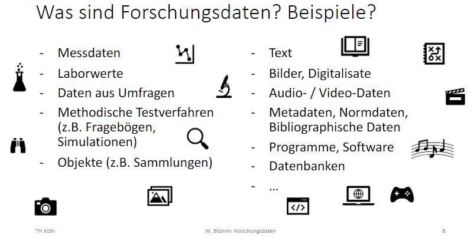
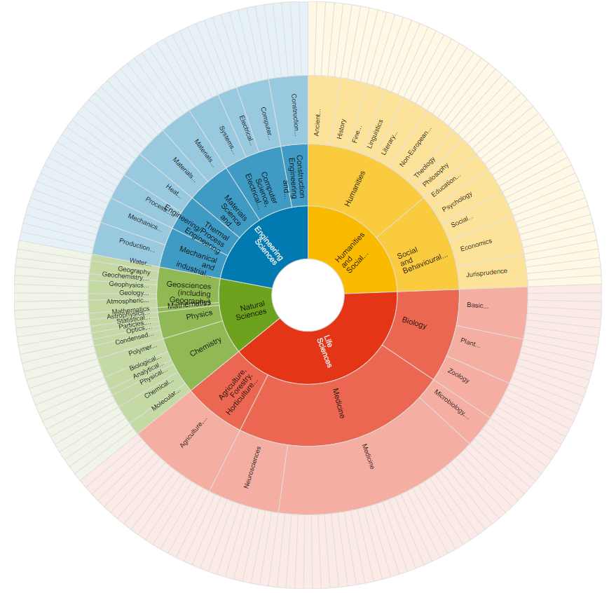

# HIP
Hochschulweite interdisziplinäre Projektwoche Sommersemester 2023.

**Das Universum der Daten: Verwundbarkeit und Zukunft datenbasierter Gesellschaften.**

Entwickeln Sie in Ihrem fakultätsübergreifenden Team eine interdisziplinäre Projektidee zum Thema *Das Universum der Daten: Verwundbarkeit und Zukunft datenbasierter Gesellschaften*. In der Projektidee sollen das methodische und inhaltliche Know-how der unterschiedlichen Fach-disziplinen zusammenfließen. Machen Sie sich also die Perspektiven und Anforderungen der in Ihrem Team vertretenen Fachdisziplinen bewusst und bringen Sie sie aktiv in den gemeinsamen Arbeitsprozess ein.

Ladet euch bitte die [Test-Datei](TH-Koeln-FDM/HIP/test_datei.docx) zum Bearbeiten runter.

Materialien zum Thema Datenmanagement werden Ihnen zur Verfügung gestellt von:
Prof. Mirjam Blümm, Katharina Fritsch und Janiça Hackenbuchner

# Daten

## Daten, Datentypen & Datenformate

- **Daten** sind einzelne Fakten oder Beobachtungen, die aber noch nicht strukturiert sind.
- **Information** kann aus Daten abgeleitet werden, in dem man diese sortiert, strukturiert und zusammenführt.
- **Wissen** beschreibt Zusammenhänge, Regeln und Theorien.
- **Weisheit** zielt auf die Bewertung des Wissens und der möglichen Handlungen ab.

*Quelle:* DaLI / DIKW Hierarchie

### Forschungsdaten

Forschungsdaten sind (digitale) Daten, die während wissenschaftlicher Tätigkeit (z. B. durch Messungen, Befragungen, Quellenarbeit) entstehen. Sie bilden eine Grundlage wissenschaftlicher Arbeit und dokumentieren deren Ergebnisse.

Quelle: [forschungsdaten.info](https://forschungsdaten.info/themen/informieren-und-planen/was-sind-forschungsdaten/)

*Quelle: Mirjams FDM-Kurs*

## Videos

!?[Forschungsdatenmanagement](https://www.youtube.com/watch?v=hcHCUN-kZaA)

([Quelle: H-BRS](https://www.h-brs.de/de/bib/forschungsdatenmanagement))

### Von DaLI
!?[3min Video](https://medien.cedis.fu-berlin.de/data_literacy/a_data_literacy/01_dl-allgemein_720p.mp4 "Was ist Data Literacy")

[10min Video](https://www.youtube.com/watch?v=yhO_t-c3yJY): Data, Data Forms & Data Literacy (Englisch) → komplette Playlist (16 Videos): [Arizona State University "Data Literacy" Study Hall](https://www.youtube.com/watch?v=0H8awA3GBPg&list=PLID58IQe16nE-1980HOGDWsvf0skE2jvS)

# Daten finden

- Wo finde ich was?
- Wie komme ich an offene Daten ran?

[Repositorien für Forschungsdaten](https://zenodo.org/record/3900922#.ZCGkpXZBxPY)

- Informationen zum Thema
- Qualitätsmerkmale eines guten Repositoriums
- Auflistung von kostenfreien Services und Angeboten

[Handreichung Forschungsdatenrepositorien PDF](https://th-koeln.sciebo.de/f/751185304)

## Repositorien
- Fachbezogenes Repositorium:
    - [re3data](https://www.re3data.org/)
- Fachübergreifende Repositorien:
    - [Zenodo](https://zenodo.org/) → ein disziplinübergreifendes Repositorium. Wird von der Europäischen Kommission finanziert, ist aus dem Projekt OpenAIRE entstanden und wird am CERN gehostet. 
    - [EUDAT/B2Share](http://b2share.eudat.eu/) → soll den Umgang mit Forschungsdaten vereinfachen. Die Plattform ist aus dem Horizon 2020 Förderungsprogramm der Europäischen Union entstanden. 
    - [OSF](http://osf.io/) → wurde vom Center for Open Science entwickelt und wird in den USA gehostet.
    - [figshare](http://figshare.com/) → besonders für visuelle Grafikdatensätze wie Poster, Diagramme oder Videos ausgelegt ist. Wird von der Nature Publishing Group angeboten.
    - [Dryad](https://datadryad.org/stash) → Amerikanische, disziplinübergreifende Plattform. Wird von Dryad von der California Digital Library gehostet.
    - [Digitale Bibliothek Thüringen](https://www.db-thueringen.de/content/index.xml) → für Thüringer Hochschulen (?)

*Beispiel von [re3data "browse by subject"](https://www.re3data.org/browse/by-subject/)*

## Videos

[10min Video](https://www.youtube.com/watch?v=HMYpfwItUiY&list=PLID58IQe16nE-1980HOGDWsvf0skE2jvS&index=16): Find (relevant) Data (Englisch)

# Datenlebenszyklus

Hier kommt Info zum Datenlebenszyklus

Hier könnte dann z. B. ein Quiz stehen.

Welche Phasen gehören in den Datenlebenszyklus? 

    [( )] 1 2 und 3
    [(X)] 2 3 und 4
    [( )] 1 3 und 4
    [( )] Alle

# Dokumentation

Hier kommt Info zur Doku

# Strukturieren und Ordnen

Hier kommt Info zum Strukturieren und Ordnen

# Speichern

Das untere wird nicht angezeigt, das ist ein eingebetteter h5p "fill in the blanks" Text. Wurde [hier](https://github.com/andre-dietrich/H5P-Test/blob/main/README.md) von Andre Dietrich so gezeigt, aber funktioniert nicht. Und [hier](https://liascript.github.io/course/?https://raw.githubusercontent.com/andre-dietrich/H5P-Test/main/README.md#1) sein LiaScript-Beispiel.

<iframe src="https://h5p.org/h5p/embed/1381483" width="1091" height="344" frameborder="0" allowfullscreen="allowfullscreen" allow="geolocation *; microphone *; camera *; midi *; encrypted-media *" title="Speichern"></iframe>

# Rechtliche Aspekte

Hier kommt Info zu den rechtlichen Aspekten