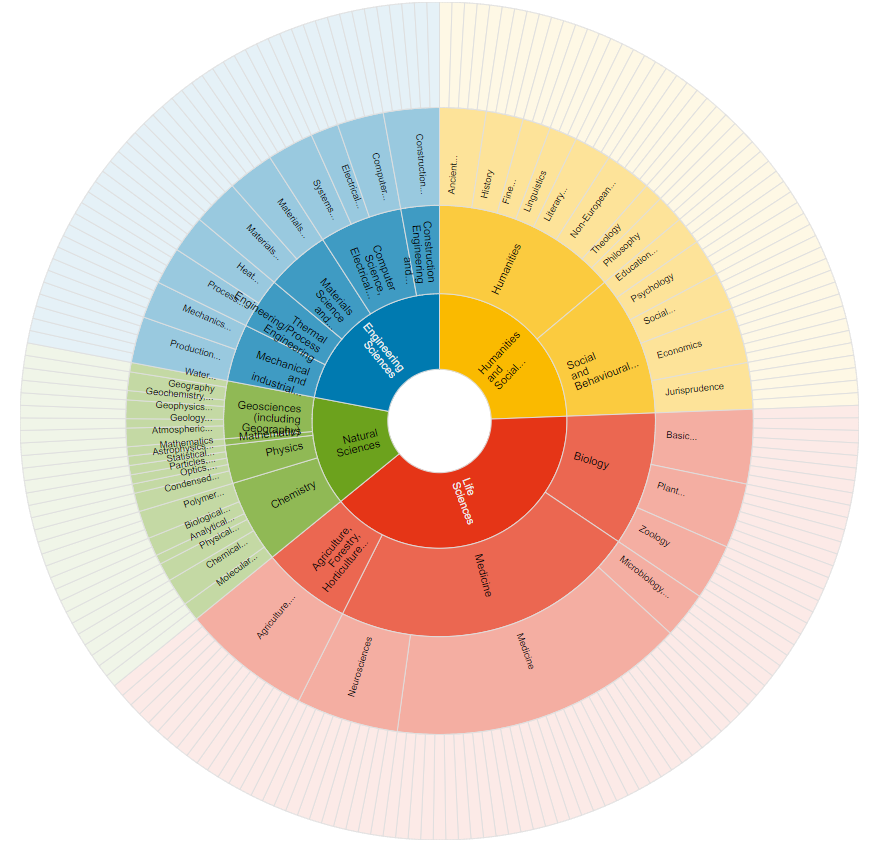

- Wo finde ich was?
- Wie komme ich an offene Daten ran?

[Repositorien für Forschungsdaten](https://zenodo.org/record/3900922#.ZCGkpXZBxPY)

- Informationen zum Thema
- Qualitätsmerkmale eines guten Repositoriums
- Auflistung von kostenfreien Services und Angeboten

[Handreichung Forschungsdatenrepositorien PDF](https://th-koeln.sciebo.de/f/751185304)

## Repositorien
- Fachbezogenes Repositorium:
    - [re3data](https://www.re3data.org/)
- Fachübergreifende Repositorien:
    - [Zenodo](https://zenodo.org/) → ein disziplinübergreifendes Repositorium. Wird von der Europäischen Kommission finanziert, ist aus dem Projekt OpenAIRE entstanden und wird am CERN gehostet. 
    - [EUDAT/B2Share](http://b2share.eudat.eu/) → soll den Umgang mit Forschungsdaten vereinfachen. Die Plattform ist aus dem Horizon 2020 Förderungsprogramm der Europäischen Union entstanden. 
    - [OSF](http://osf.io/) → wurde vom Center for Open Science entwickelt und wird in den USA gehostet.
    - [figshare](http://figshare.com/) → besonders für visuelle Grafikdatensätze wie Poster, Diagramme oder Videos ausgelegt ist. Wird von der Nature Publishing Group angeboten.
    - [Dryad](https://datadryad.org/stash) → Amerikanische, disziplinübergreifende Plattform. Wird von Dryad von der California Digital Library gehostet.
    - [Digitale Bibliothek Thüringen](https://www.db-thueringen.de/content/index.xml) → für Thüringer Hochschulen (?)

*Beispiel von [re3data "browse by subject"](https://www.re3data.org/browse/by-subject/)*

## Videos

[10min Video](https://www.youtube.com/watch?v=HMYpfwItUiY&list=PLID58IQe16nE-1980HOGDWsvf0skE2jvS&index=16): Find (relevant) Data (Englisch)