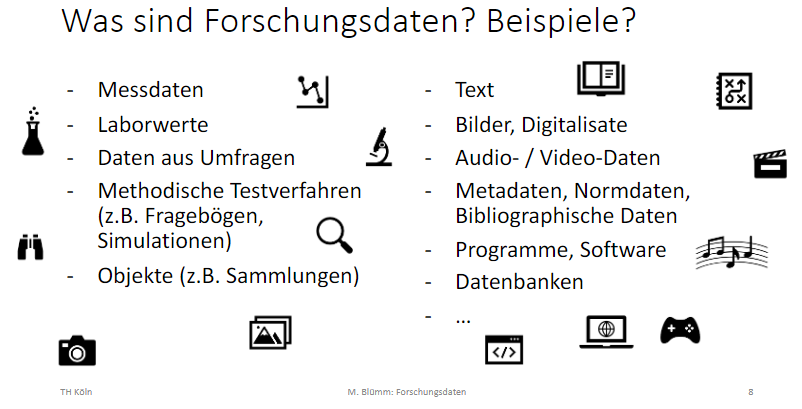

# Daten

## Daten, Datentypen & Datenformate

- **Daten** sind einzelne Fakten oder Beobachtungen, die aber noch nicht strukturiert sind.
- **Information** kann aus Daten abgeleitet werden, in dem man diese sortiert, strukturiert und zusammenführt.
- **Wissen** beschreibt Zusammenhänge, Regeln und Theorien.
- **Weisheit** zielt auf die Bewertung des Wissens und der möglichen Handlungen ab.

*Quelle:* DaLI / DIKW Hierarchie

### Forschungsdaten

Forschungsdaten sind (digitale) Daten, die während wissenschaftlicher Tätigkeit (z. B. durch Messungen, Befragungen, Quellenarbeit) entstehen. Sie bilden eine Grundlage wissenschaftlicher Arbeit und dokumentieren deren Ergebnisse.

Quelle: [forschungsdaten.info](https://forschungsdaten.info/themen/informieren-und-planen/was-sind-forschungsdaten/)

*Quelle: Mirjams FDM-Kurs*

## Videos
[2min Video](https://youtu.be/cMP9v7Se6cY): FDM erklärt ([Quelle: H-BRS](https://www.h-brs.de/de/bib/forschungsdatenmanagement))

### Von DaLI
[3min Video](https://www.cedis.fu-berlin.de/services/e-learning/dataliteracy/lehrvideos/intro-data-literacy/index.html): Was ist Data Literacy

[10min Video](https://www.youtube.com/watch?v=yhO_t-c3yJY): Data, Data Forms & Data Literacy (Englisch) → komplette Playlist (16 Videos): [Arizona State University "Data Literacy" Study Hall](https://www.youtube.com/watch?v=0H8awA3GBPg&list=PLID58IQe16nE-1980HOGDWsvf0skE2jvS)